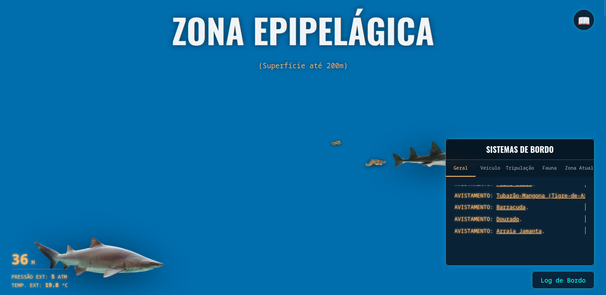

# Deep Blue | Dos 0 aos 11000 metros


> **Uma experiência web imersiva que simula uma expedição científica às profundezas do oceano, da superfície até a Fossa das Marianas, IMPORTANTE: O PROJETO AINDA NÃO POSSUI SUPORTE GARANTIDO EM MOBILE, PROVAVELMENTE NÃO DEVE RODAR COMO O ESPERADO, grato**

---

## Sobre o Projeto

**Deep Blue** não é apenas uma página web, é um simulador de profundidade. O projeto utiliza a barra de rolagem do navegador como mecanismo de descida, onde cada pixel representa uma medida real de profundidade.

O objetivo é explorar as **5 Zonas Oceânicas** (Epipelágica a Hadopelágica), descobrir espécies reais, coletar dados para o seu **Bestiário** e monitorar os sistemas do seu submersível através de um HUD interativo.

### Demo Online
[](https://vinicius3442.github.io/Deepsea/)
*(Já ponho já)*

---

## Interface & Imersão

<div align="center">
  
  <p><em>Interface principal simulando a Zona Epipelágica do Oceano (0 a 200 metros) com HUD de monitoramento dos sistemas do submersível.</em></p>
</div>

---

## Funcionalidades Principais

### 1. Scroll como Mecânica de Jogo
* **Escala Real:** A altura da página é calculada dinamicamente baseada na profundidade máxima (11.000m).
* **Física do Ambiente:** Funções matemáticas calculam e atualizam em tempo real a **Pressão (ATM)** e a **Temperatura (°C)** baseadas na profundidade atual do scroll.
* **Mudança Atmosférica:** O background muda dinamicamente (de azul claro para escuridão total) conforme você desce, usando interpolação de cores RGB via JavaScript.

### 2. Sistema de Fauna Dinâmica (Async/Await)
* Os animais não estão "hardcoded" no HTML. Eles são carregados via **Fetch API** a partir de arquivos JSON separados por zona (`mesopelagic-fauna.json`, etc.).
* **Lazy Loading:** Imagens e comportamentos só ativam quando entram na "Viewport" do submersível, garantindo alta performance.

### 3. Bestiário Persistente (LocalStorage)
* Ao clicar em um animal, você coleta dados sobre ele.
* O sistema salva suas descobertas no navegador (`localStorage`). Se você fechar a aba e voltar amanhã, seu progresso na enciclopédia continua lá.


### 4. HUD & Sistemas de Bordo
* Painel lateral interativo que simula um sistema operacional de submarino.
* Logs de texto digitados em tempo real ("Sistemas online...", "Entrando na Zona Mesopelágica").
* Monitoramento de status (Casco, Oxigênio, Energia), vou expandir futuramente.

---

## Tecnologias e Conceitos Aplicados

* **JavaScript Moderno (ES6+):** Uso intenso de Módulos (`import/export`) para separar a lógica (Config, Modal, Particles, HUD).
* **Manipulação de DOM Avançada:** Criação dinâmica de elementos HTML baseada em dados JSON.
* **CSS3 Criativo:**
    * Animações de ondas com SVG (`preserveAspectRatio="none"`).
    * Efeito de "Neve Marinha" (Marine Snow) usando Canvas API.
    * Filtros e distorções para simular a água.
* **Performance:** Uso de `requestAnimationFrame` para atualizar a lógica visual sem travar o navegador durante o scroll.

---

## Estrutura do Projeto

```bash
DeepBlue/
│
├── index.html              # A "Janela" do submarino
├── style.css               # Estilização e efeitos visuais
├── main.js                 # O "Cérebro" (Inicialização e Loops)
│
├── js/                     # Módulos JS
│   ├── config.js           # Constantes (Zonas, Profundidade Máx)
│   ├── modal.js            # Lógica dos modais de animais
│   ├── particles.js        # Sistema de partículas (Neve Marinha)
│   └── hud.js              # Controle do painel lateral
│
├── data/                   # "Banco de Dados" (JSONs)
│   ├── epipelagic-fauna.json
│   └── ...
│
└── articles/                 # Modais de informações dos animais
    ├── animal1.json
    └── ...
```

## Autores e Colaboradores

<table align="center">
  <tr>
    <td align="center">
      <a href="https://github.com/Vinicius3442">
        
      </a>
      <br />
      <sub><b>Vinícius Montuani</b></sub>
      <br />
      <small>Desenvolvimento & Engenharia</small>
      <br />
      <a href="https://www.linkedin.com/in/vinicius-montuani" target="_blank">
        
      </a>
      <a href="https://github.com/Vinicius3442" target="_blank">
        
      </a>
    </td>
    <td align="center">
      <a href="https://github.com/V-32">
        
      </a>
      <br />
      <sub><b>Vitor Gaspar</b></sub>
      <br />
      <small>Criação de Animais (JSONs) & Assets</small>
      <br />
      <a href="https://www.linkedin.com/in/vitor-gabriel-gaspar-de-paula-b37b10366/" target="_blank">
        
      </a>
      <a href="https://github.com/V-32" target="_blank">
        
      </a>
    </td>
  </tr>
</table>
