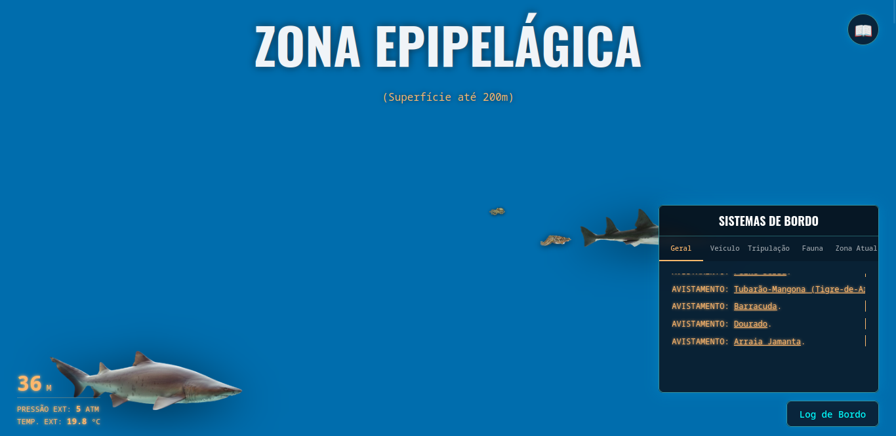

# Deep Blue | Expedição Interativa das Profundezas Oceânicas

<div align="center">




> **Uma simulação web imersiva e enciclopédia interativa que conduz o usuário em uma jornada científica e temporal das águas rasas da superfície até os 11.000 metros da Fossa das Marianas e aos oceanos pré-históricos.**

[](https://vinicius3442.github.io/Deepblue/)

**Link direto da aplicação:** [https://vinicius3442.github.io/Deepblue/](https://vinicius3442.github.io/Deepblue/)

</div>

---

## Sobre o Projeto

**Deep Blue** transforma a barra de rolagem do navegador em uma métrica de descida oceânica em escala real, onde cada **25 pixels representam 1 metro de profundidade verdadeira**. A expedição percorre as 5 grandes Zonas Pelágicas da Terra, integrando física ambiental simulada, enciclopédia marinha com persistência local, captura fotográfica, som imersivo e viagens no tempo até eras paleooceanográficas.

---

## Funcionalidades Principais

### 1. Descida em Escala Real & Física do Ambiente
* **Profundidade Total de 11.000 Metros:** O canvas vertical do oceano possui mais de 275.000 pixels de altura calculados dinamicamente.
* **Telemetria de Bordo em Tempo Real:**
  * **Pressão Hidrostática (ATM):** Calculada dinamicamente conforme a fórmula $P = 1 + \frac{\text{profundidade}}{10}$.
  * **Gradiente Térmico (°C):** Modelo termoclino simulando a queda gradual de 20°C na superfície para ~2°C nas fossas hadais.
* **Atmosfera & Iluminação Dinâmica:** Interpolação matemática RGB da cor do oceano e atenuação da iluminação conforme a absorção da luz solar diminui com a profundidade.
* **Neve Marinha (Marine Snow Canvas API):** Sistema de partículas 2D interativo ativado em profundidades abissais para simular detritos orgânicos caindo pela coluna d'água.

---

### 2. Fauna Marinha com Inteligência de Comportamento
* **Carregamento Modular Assíncrono:** Os animais não são codificados rigidamente no HTML; são carregados via **Fetch API** a partir de conjuntos de dados JSON organizados por zonas pelágicas.
* **Algoritmos de Comportamento Orgânico (`animal-behavior.js`):**
  * **Simulação Físico-Comportamental:** Movimentação natural baseada na espécie (peixes pelágicos, predadores apex, lulas a jato, lulas gigantes, águas-vivas pulsantes, flutuadores passivos e répteis).
  * **Vetor de Retorno (Home Y) & Evasão de Bordas:** Cada animal nada livremente dentro de sua faixa exata de profundidade métrica, desviando das bordas do ecossistema.
  * **Ativação Inteligente (Lazy Activation):** Renderização ativa apenas para espécimes na zona de visão do submarino, garantindo taxa de quadros (FPS) fluida.

---

### 3. Bestiário Marinho & Enciclopédia (LocalStorage)
* **Sistema RPG de Descobertas:** Avistar e interagir com uma espécie pela primeira vez dispara um alerta toast (com suporte a gestos *swipe* em dispositivos móveis).
* **Filtros Tridimensionais:**
  * **Por Busca Textual:** Filtragem instantânea por nome da espécie.
  * **Por Categoria Biológica:** Tubarões & Arraias (*Elasmobranchii*), Peixes (*Teleostei*), Moluscos & Lulas (*Molluscae*), Cnidários & Medusas (*Cnidaria*).
  * **Por Zona Pelágica:** Epipelágica, Mesopelágica, Batipelágica, Abissopelágica e Hadopelágica.
  * **Por Status de Descoberta:** Espécies já registradas vs. A Descobrir.
* **Artigos Científicos Multimídia:** Modais detalhados com Ficha Técnica, Descrição Taxonômica, Curiosidades Biológicas e Galerias de Mídia integradas (imagens e vídeos).
* **Persistência de Dados:** Progresso salvo automaticamente via `localStorage`.

---

### 4. Modo Foto & Captura de Tela
* Ferramenta de registro fotográfico que oculta temporariamente o HUD e a interface, utilizando `html2canvas` para gerar capturas PNG em alta resolução com carimbo oficial de profundidade da expedição.

---

### 5. Áudio Marinho Responsivo
* Motor sonoro via Web Audio API que ajusta a tonalidade e amortecimento das frequências subaquáticas conforme o submarino mergulha nas camadas profundas.

---

### 6. Módulo Viagem no Tempo (Paleooceanografia)
* **Salto Temporal em 3D (Three.js & WebGL):** Animação 3D interativa representando a aceleração orbital da Terra e do Sol através das eras geológicas.
* **Seleção de Linhas do Tempo Geológicas:** Navegação pelas Eras Paleozóica, Mesozóica e Cenozóica, permitindo explorar ecossistemas pré-históricos como o **Oceano Cambriano (541 Ma)** e criaturas ancestrais (Anomalocaris, etc.).

---

## As Zonas Oceânicas

| Zona | Intervalo de Profundidade | Descrição & Iluminação |
| :--- | :--- | :--- |
| **Epipelágica** | `0m - 200m` | **Zona Fotocintilante / Sunlight Zone:** Penetração solar total, suporte à fotossíntese e maior densidade populacional marinha. |
| **Mesopelágica** | `200m - 1.000m` | **Zona Crepuscular / Twilight Zone:** Penetração de luz solar mínima, surgimento da bioluminescência animal e migração vertical diária. |
| **Batipelágica** | `1.000m - 4.000m` | **Zona da Meia-Noite / Midnight Zone:** Escuridão total, pressões superiores a 100 ATM e predomínio de neve marinha. |
| **Abissopelágica** | `4.000m - 6.000m` | **Zona Abissal / Abyssal Zone:** Águas próximas do ponto de congelamento, escassez de alimento e espécies com corpos moles adaptados. |
| **Hadopelágica** | `6.000m - 11.000m` | **Zona Hadal / Hadal Zone:** Fossas oceânicas profundas (Fossa das Marianas), pressões extremas de até 1.100 ATM e organismos extremófilos. |

---

## Tecnologias Utilizadas

* **Front-End Core:** HTML5 Semântico, CSS3 Moderno (Variáveis CSS, CSS Grid, Flexbox, Glassmorphism, SVG Animations).
* **JavaScript ES6+:** Arquitetura baseada em Módulos JS (`import`/`export`), Assincronismo (`async/await`, `Fetch API`), Manipulação Avançada de DOM.
* **Gráficos 3D & Animação:** `Three.js` (WebGL para a transição do Salto Temporal), Canvas 2D API (para partículas de neve marinha), `requestAnimationFrame` para física suave.
* **Utilitários & Libs:** `html2canvas` (Captura de fotos em PNG), Web Audio API (Sons de ambiente marinho).

---

## Estrutura do Projeto

```bash
Deepblue/
├── index.html              # Janela principal da expedição e interface HUD
├── style.css               # Sistema de design, animações e layout responsivo
├── main.js                 # Controlador principal (Event Loop, Scroll, Gerenciador de Fauna)
│
├── js/                     # Módulos JavaScript (ES6)
│   ├── config.js           # Constantes do ecossistema (Zonas, Escala, Parâmetros)
│   ├── animal-behavior.js  # Motor de física, animação e comportamento animal
│   ├── modal.js            # Controle dos modais de artigos enciclopédicos
│   ├── bestiary.js         # Lógica do Bestiário, busca e persistência
│   ├── particles.js        # Canvas 2D para partículas de Neve Marinha
│   ├── hud.js              # Atualizador em tempo real dos instrumentos do HUD
│   ├── audio.js            # Sintetizador e controle de áudio responsivo
│   └── visuals.js          # Efeitos visuais e sombras de profundidade
│
├── data/                   # Registros da fauna por zona pelágica (JSON)
│   ├── epipelagic-fauna.json
│   ├── mesopelagic-fauna.json
│   ├── bathypelagic-fauna.json
│   ├── abyssopelagic-fauna.json
│   └── hadopelagic-fauna.json
│
├── articles/               # Banco de dados de artigos enciclopédicos (JSON)
│   ├── cnidaria/
│   ├── elasmobranchii/
│   ├── fish/
│   └── molluscae/
│
├── img/                    # Assets gráficos (Sprites dos animais, background, sky)
│   └── Animals/
│
├── timetravel/             # Módulo 3D de viagem no tempo (Three.js WebGL)
│   ├── timetravel.html
│   ├── timetravel.js
│   └── timetravel.css
│
├── timeline/               # Seleção visual de linhas do tempo geológicas
│   ├── select.html
│   ├── select.js
│   └── select.css
│
└── past_oceans/            # Oceanos pré-históricos exploráveis
    └── cambrian/           # Módulo interativo do Período Cambriano
        ├── index.html
        ├── cambrian.js
        └── cambrian.css
```

---

## Como Executar Localmente

Como o projeto utiliza **Módulos ES6 (`import`/`export`)** e requisições assíncronas de arquivos JSON (`fetch`), ele deve ser executado através de um servidor local (HTTP Server).

1. **Clone o repositório:**
   ```bash
   git clone https://github.com/Vinicius3442/Deepblue.git
   cd Deepblue
   ```

2. **Inicie um servidor local:**
   * Usando a extensão **Live Server** no VS Code: Abra o arquivo `index.html` e clique em *Go Live*.
   * Ou via Python:
     ```bash
     python -m http.server 8000
     ```
   * Ou via Node.js / npx:
     ```bash
     npx serve .
     ```

3. **Acesse no navegador:**
   Navegue para `http://localhost:8000` (ou porta fornecida pelo seu servidor).

---

## Autores & Colaboradores

<table align="center">
  <tr>
    <td align="center" width="50%">
      <a href="https://github.com/Vinicius3442">
        
      </a>
      <br />
      <br />
      <b>Vinícius Montuani</b>
      <br />
      <sub>Engenharia de Software, Arquitetura JS, Mecânicas de Profundidade & Módulos 3D</sub>
      <br />
      <br />
      <a href="https://www.linkedin.com/in/vinicius-montuani" target="_blank">
        
      </a>
      <a href="https://github.com/Vinicius3442" target="_blank">
        
      </a>
    </td>
    <td align="center" width="50%">
      <a href="https://github.com/V-32">
        
      </a>
      <br />
      <br />
      <b>Vitor Gaspar</b>
      <br />
      <sub>Curadoria Científica de Fauna, Base de Dados JSON, Artigos & Assets Gráficos</sub>
      <br />
      <br />
      <a href="https://www.linkedin.com/in/vitor-gabriel-gaspar-de-paula-b37b10366/" target="_blank">
        
      </a>
      <a href="https://github.com/V-32" target="_blank">
        
      </a>
    </td>
  </tr>
</table>

---

<div align="center">
  <sub>Desenvolvido com paixão pela ciência oceânica e engenharia web. ⚓ Deep Blue Expeditions.</sub>
</div>
